# AREP

## Pre-requisitos
* [Maven](https://maven.apache.org/) - Administrador de dependencias
* [Git](https://git-scm.com/) - Sistema de control de versiones
* [Node-npm](https://nodejs.org/es/download/) -  Javascript build - Package Manager

## Tutorial

1. Clone el repositorio utilizando el siguiente comando
    ```
    git clone https://github.com/Jcro15/AREP-AutoScaling-Tutorial.git
    ```
2. Compile el proyecto utilizando el siguiente comando
    ```
    mvn package
    ```
3. Inicialice una instancia de EC2
    - Lance una nueva instancia
    - Seleccione la imagen Amazon Linux AMI 2018.03.0 (HVM), SSD Volume Type
    - Seleccione el tamaño t2.micro
4. Agregue una nueva regla de entrada
    - Seleccione el grupo de seguridad que se creó junto con la instancia
    - Añada una nueva regla de entrada como la que se muestra en la siguiente imagen
    - 
    
5. Copie las clases y las dependencias del proyecto en la instancia
    - Usando el protocolo sftp y el comando put copie las carpetas target/classes y target/dependency del proyecto en la
    máquina virtual dentro de un nuevo directorio. Dentro de la máquina virtual debería tener directorios como los siguientes 
    fibonacciapp/classes y fibonacciapp/dependency 
    - Para conectarse usando el protocolo sftp use el siguiente comando reemplazando el nombre del archivo con las
    llaves de la máquina y la dirección ip de esta
    ```
   sftp -i "<archivo con la llave de la instancia>" ec2-user@<Direccion IP Instancia>
   ```
6. Configure la instancia para que la aplicación se ejecute automáticamente al iniciar
    - Conéctese a la instancia usando el protocolo ssh con el siguiente comando
    ```
      ssh -i "<archivo con la llave de la instancia>" ec2-user@<Direccion IP Instancia>
   ```     
   - Instale java utilizando los siguientes comandos
   ```
   sudo yum install java-1.8.0
   sudo yum install java-1.8.0-openjdk-devel
   sudo yum remove java-1.7.0-openjdk
   ```
   - Configure el archivo rc.local para ejecutar la aplicación cuando la instancia se inicie.Para esto abra
   el archivo con el siguiente comando
   ```
   sudo vi /etc/rc.local
   ```
   - En la última línea agregue el comando de java para ejecutar la aplicación. a continuación se presenta un ejemplo
   ```
   java -cp /<ruta a fibonacciapp>/fibonacciapp/classes:/<ruta a fibonacciapp>/fibonacciapp/dependency/* edu.escuelaing.arep.SparkWebApp &
   ```
    El archivo debería verse como el que se presenta a continuación
    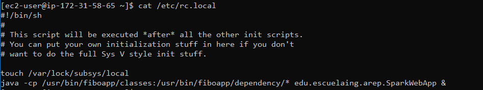
7. Ejecute las pruebas de carga de la forma que lo especifica la sección [Ejecutar pruebas de carga](#ejecutar-pruebas-de-carga) usando
como host la dirección IP de la máquina creada. Luego verifique el uso de CPU de la instancia en la pestaña de monitoreo.En este punto la instancia
debería tener un porcentaje de uso de CPU cercano el 100% y sus respuestas tardarán bastante

8. Cree una AMI a partir de la instancia construida
    - Desde el panel de administración de instancias EC-2 haga click derecho sobre la
    instancia creada y seleccione la opción Image and templates>Crear imagen como se ve en la siguiente imagen:
    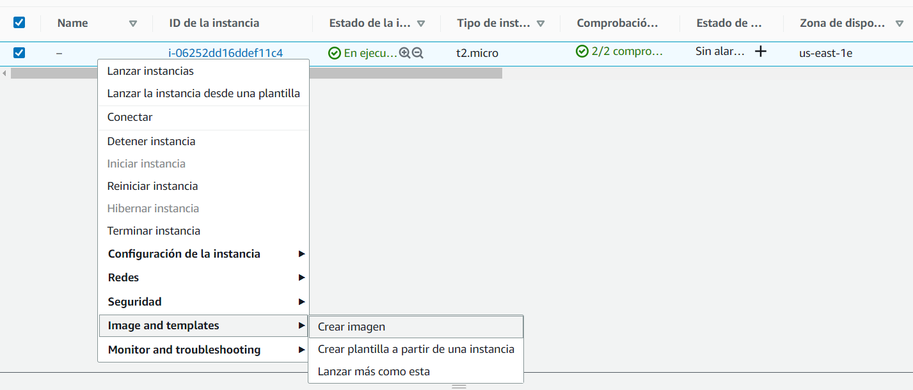
    - Escriba un nombre para la imagen y pulse el botón "Crear imagen"
    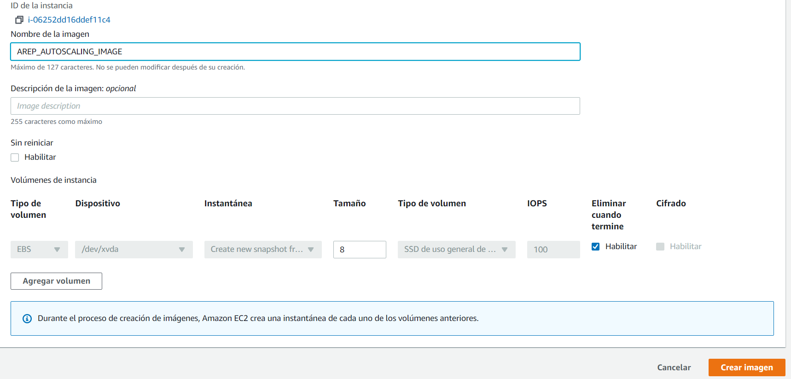
    
9. Cree una configuración de lanzamiento con la imagen creada
    - Seleccione el panel de configuraciones de lanzamiento en la sección de auto escalamiento y pulse
    en crear configuración de lanzamiento como se muestra a continuación
    
    - Escriba un nombre para la configuración de lanzamiento
    - Seleccione la imagen creada anteriormente
    - Seleccione el tipo de instancia t2.micro
    
    - Seleccione el grupo de seguridad que se creó junto con la instancia creada anteriormente
    
    - Seleccione el par de llaves que creó junto con la instancia anterior.
    - Pulse en Crear configuración de lanzamiento.
10. Cree un grupo de autoescalamiento utilizando la configuración de lanzamiento creada
    - Seleccione el panel de grupos autoescalamiento
    - Escriba un nombre para el grupo y seleccione la configuración de lanzamiento creada anteriormente
    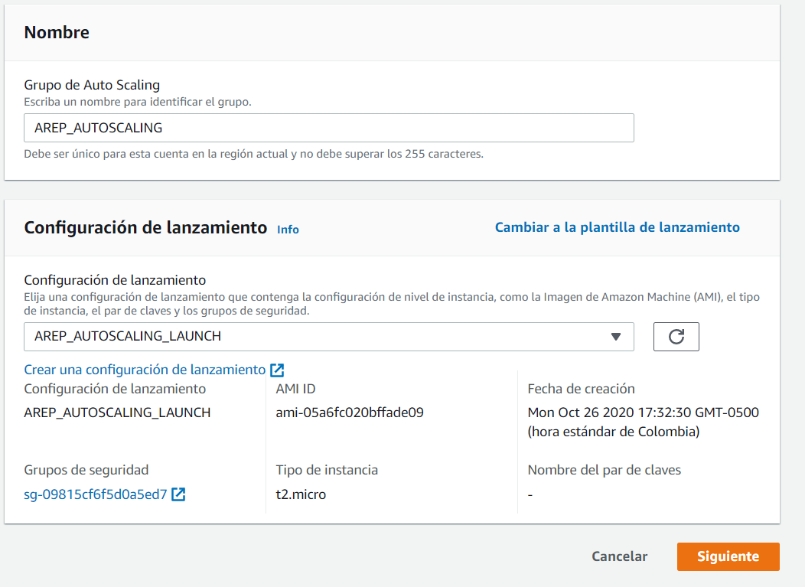
    - Seleccione la VPC por defecto y algunas sub-redes para tener varias zonas de disponibilidad 
    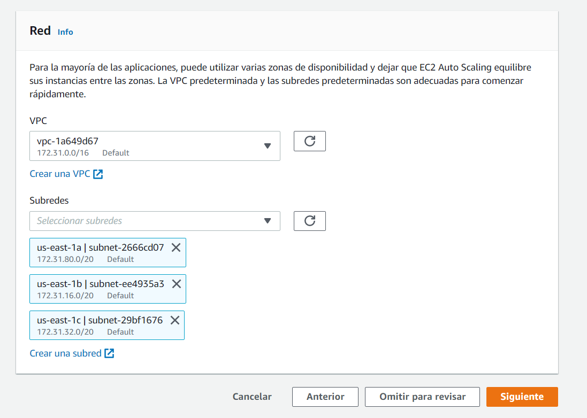
    - Continue hasta el paso 4 y ahi cambien el tamaño maximo del grupo a 3 y habilite la politica
    de escalado automático como se ve en la foto
    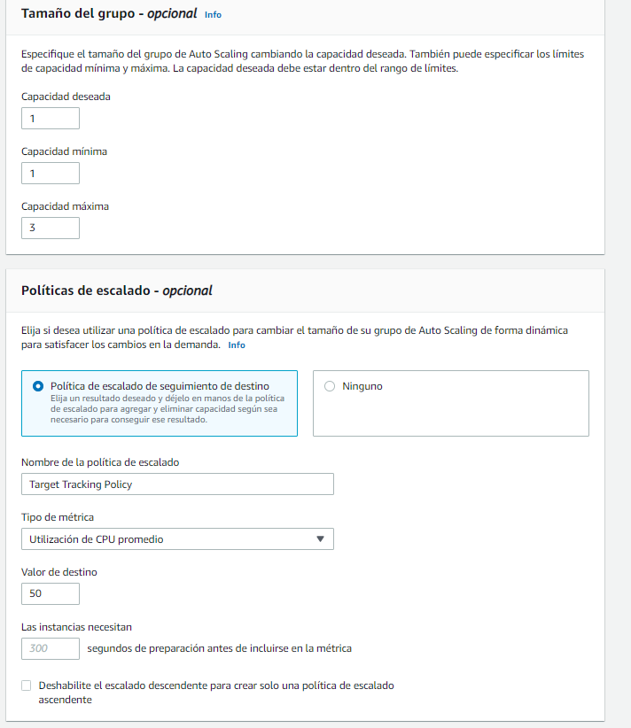
    - Presione Omitir para revisar y luego cree el grupo de autoescalamiento.
11. Cree un balanceador de carga y asignelo al grupo de autoescalamiento.
    - Seleccione el panel de balanceadores de carga y cree un nuevo balanceador
    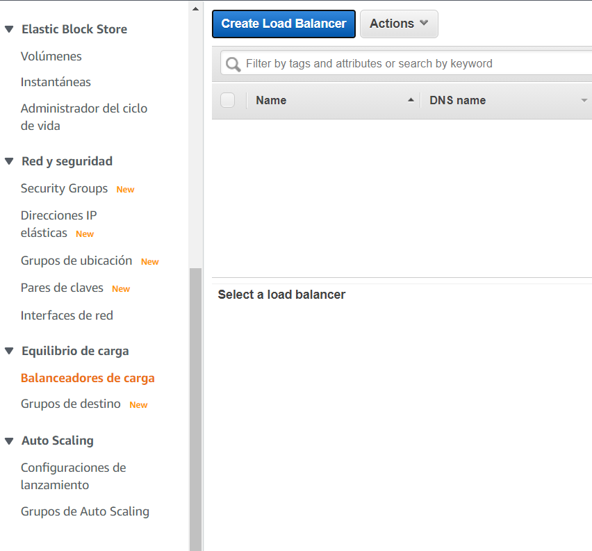
    - Seleccione un balanceador de carga de aplicacion 
    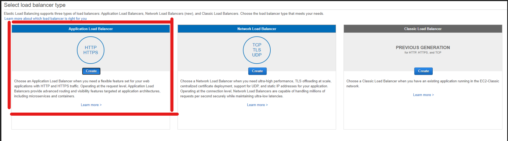 
    - Escriba un nombre para el balanceador y seleccione las zonas de disponibilidad, estas deben ser las mismas que se especificaron
    en el grupo de auto escalamiento.La configuración se muestra a continuación
    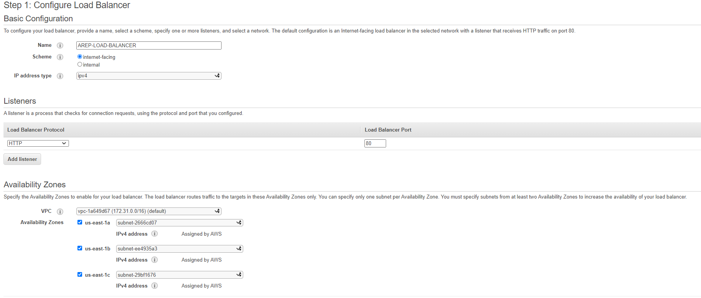
    - Cree un nuevo grupo de seguridad con la regla que se muestra en la siguiente imagen para permitir el trafico de entrada
    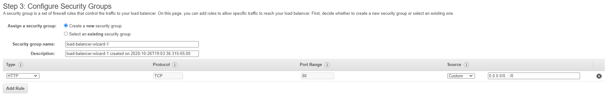
    - Cree un nuevo grupo objetivo ,escriba el nombre del grupo y use el puerto 4567 que es el puerto que las instancias del
    grupo de escalamiento tienen abierto
    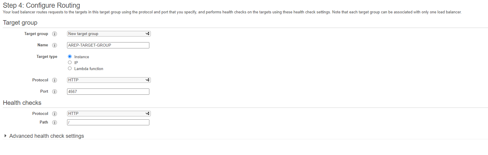
    - Omita el siguiente paso y continue hasta terminar de crear el balanceador
    - Seleccione el balanceador de carga creado, y use la opción de editar atributos para cambiar el
    idle time a 600 segundos.
    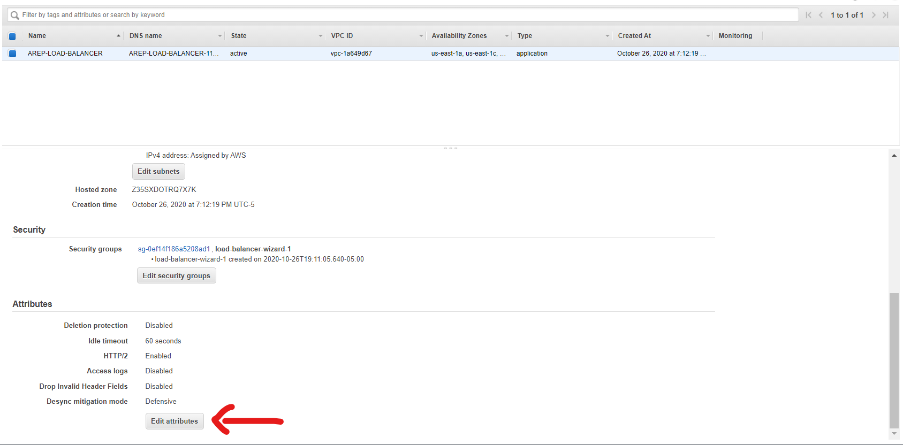
    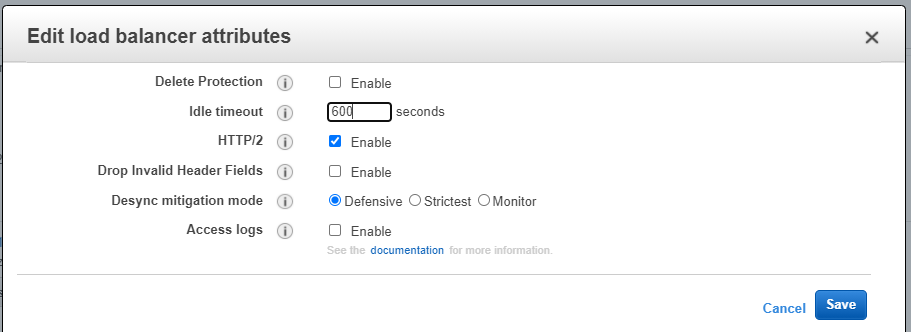
 12. Asigne el balanceador de carga al grupo de escalamiento
    - Seleccione el grupo de escalamiento creado anteriormente y luego seleccione la pestaña "Detalles"
    Allí encontrará una sección de balance de carga, seleccione la opción de editar
    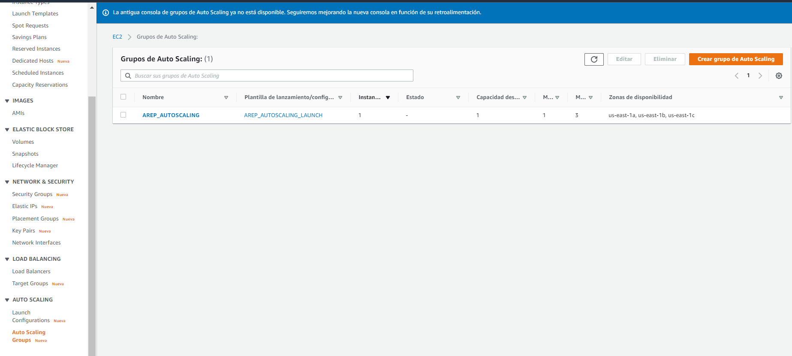
    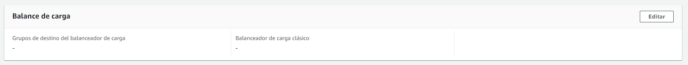
    - En la pestaña de editar se debe seleccionar el grupo objetivo que se creó junto con el
    balanceador de carga, no se debe seleccionar el balanceador de carga como tal
    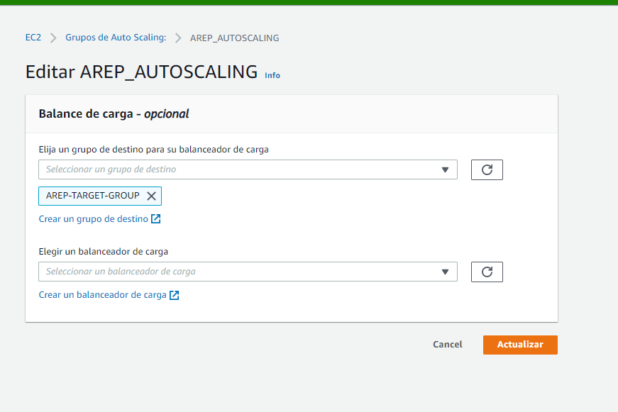
 13. Ejecute nuevamente las pruebas, esta vez con la dirección del balanceador de carga,luego
 revise que el grupo de escalamiento genera nuevas instancias y observe el comportamiento de estas, se deberían generar
 3 instancias y cada una debería hacer un uso de CPU respectivo al cálculo de las peticiones. Inicialmente las peticiones
 pueden llegar a tardar, sin embargo conforme se añadan nuevas instancias los tiempos de respuesta deberían disminuir. El Uso de CPU
 inicialmente será cercano al 100% para la primera máquina, luego las nuevas peticiones se distribuirán en las nuevas máquinas por lo que
 esta métrica debería reducirse.
    
## Ejecutar pruebas de carga
Desde su computador.

Instale newman usando el siguiente comando 
```
npm install newman -g
```            
Modifique el archivo [AREP_AUTOSCALING_LAB].postman_environment.json que está 
ubicado en la carpeta postman, cambie el valor del parámetro VM1 para que este corresponda
a la IP de la máquina a la que se le harán las pruebas y el valor del parámetro port para que  este sea
número del puerto por el que se enviarán las peticiones

Una vez que esté lista la configuración en 4 consolas distintas ejecute el siguiente comando en cada una desde la carpeta postman,
esto con el objetivo de enviar 4 peticiones concurrentes que se repetirán 10 veces, cada una solicitando
el valor 1000000  de la secuencia de fibonacci.
```
newman run AREP_AUTOSCALING_LAB.postman_collection.json -e [AREP_AUTOSCALING_LAB].postman_environment.json -n 10
```

## Resultados
### Sin escalamiento
#### Uso de Cpu de la instancia
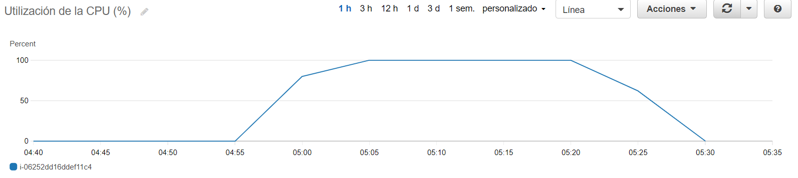
#### Resultado de las pruebas
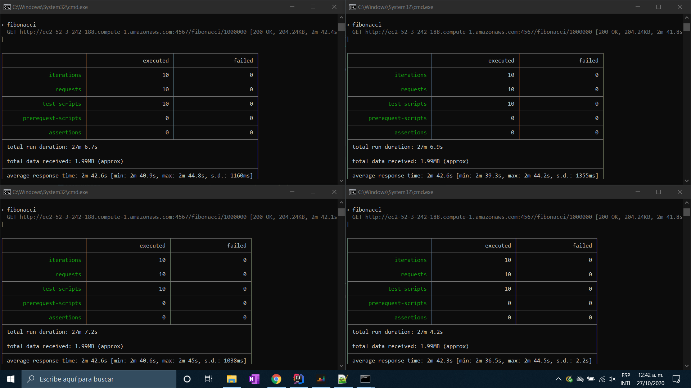

### Con escalamiento
#### Uso de Cpu del grupo de escalamiento
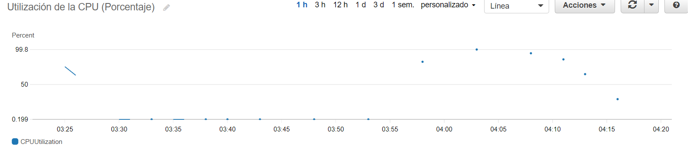
#### Registro de actividad del grupo
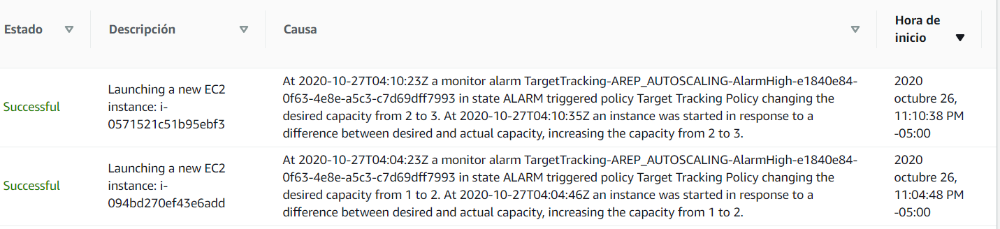
#### Uso de Cpu primera instancia
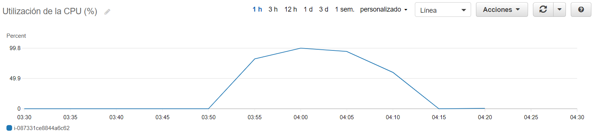
#### Uso de Cpu segunda instancia
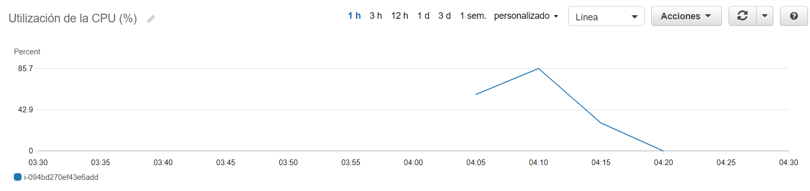
#### Uso de Cpu tercera instancia
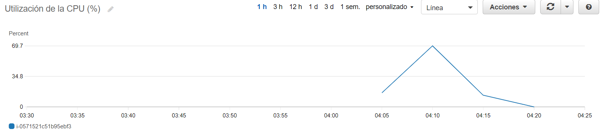
#### Promedio de tiempos de respuesta de las instancias al balanceador

#### Conteo de peticiones recibidas

#### Resultado de las pruebas
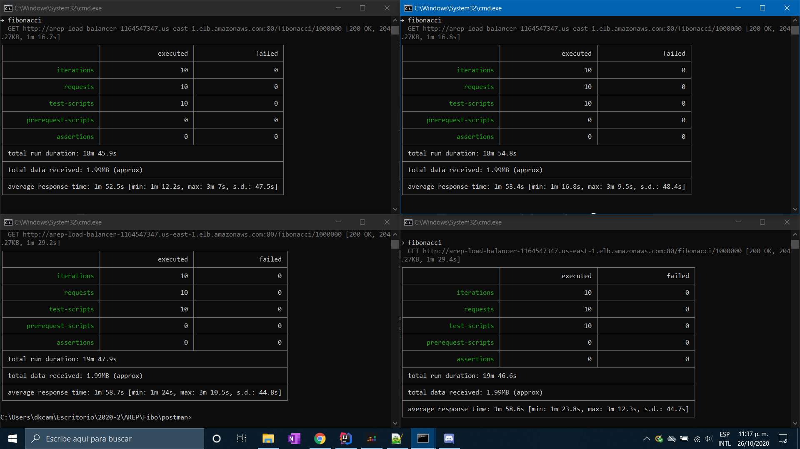


## Construido con
* [Maven](https://maven.apache.org/) - Administrador de dependencias
* [Junit](https://junit.org/junit5/) - Framework para pruebas en java
* [Spark](http://sparkjava.com/) - Micro-framework para desarrollar aplicaciones web

## Autor

* **Juan Camilo Rojas Ortiz** - *Estudiante de ingeniería de sistemas* 

## Licencia

Este proyecto esta bajo la licencia GNU(General Public License) los detalles se pueden encontrar en el archivo [LICENSE](LICENSE)

